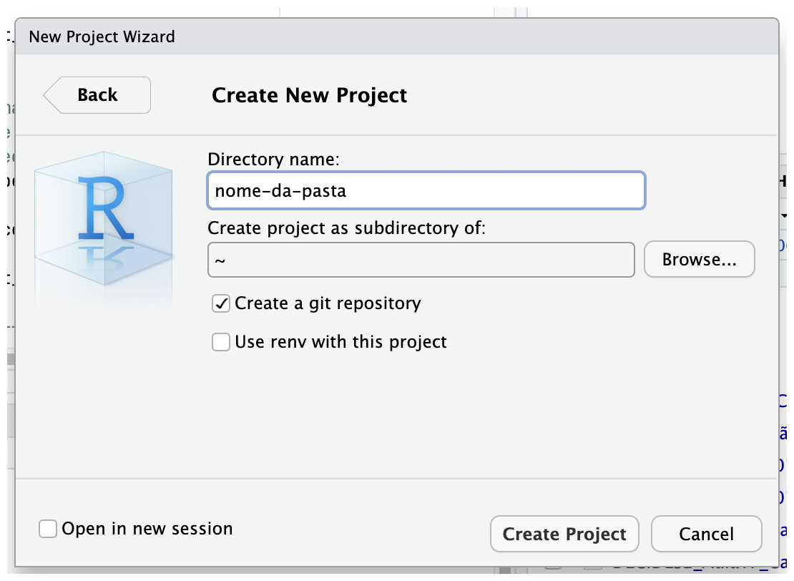
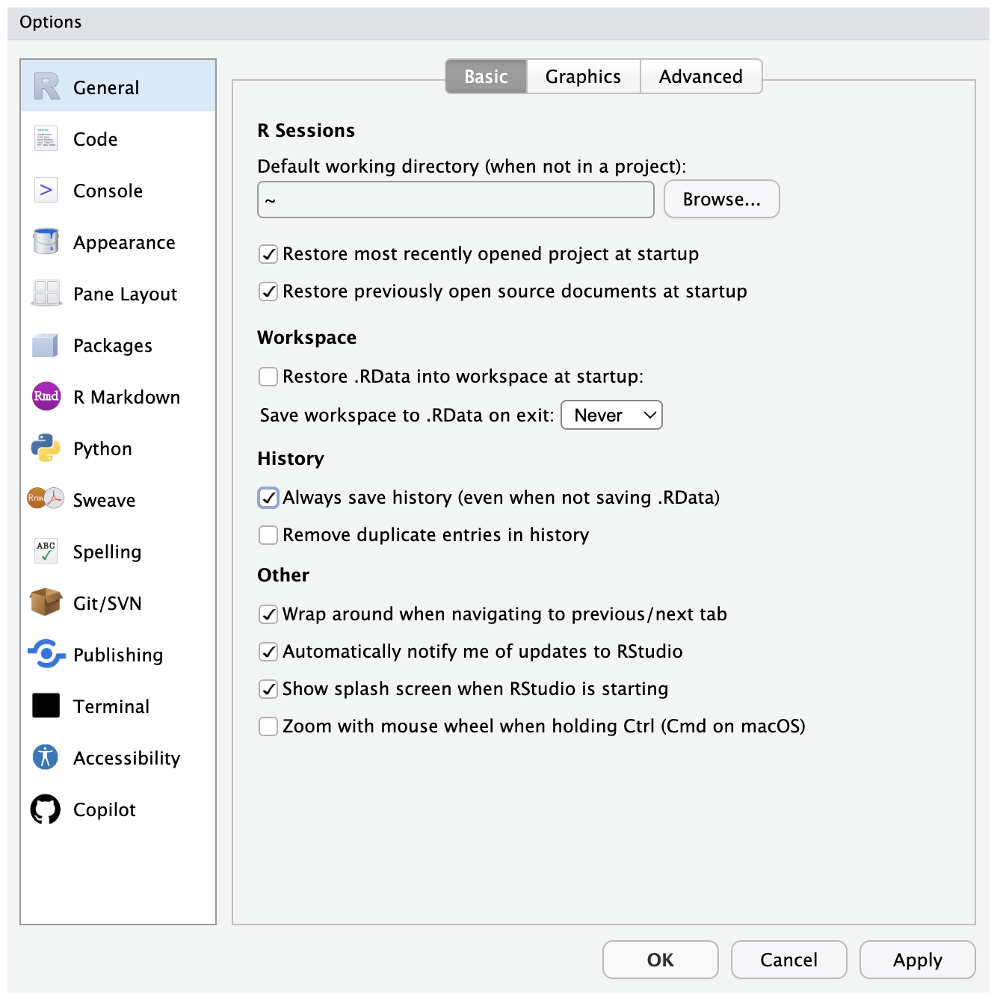
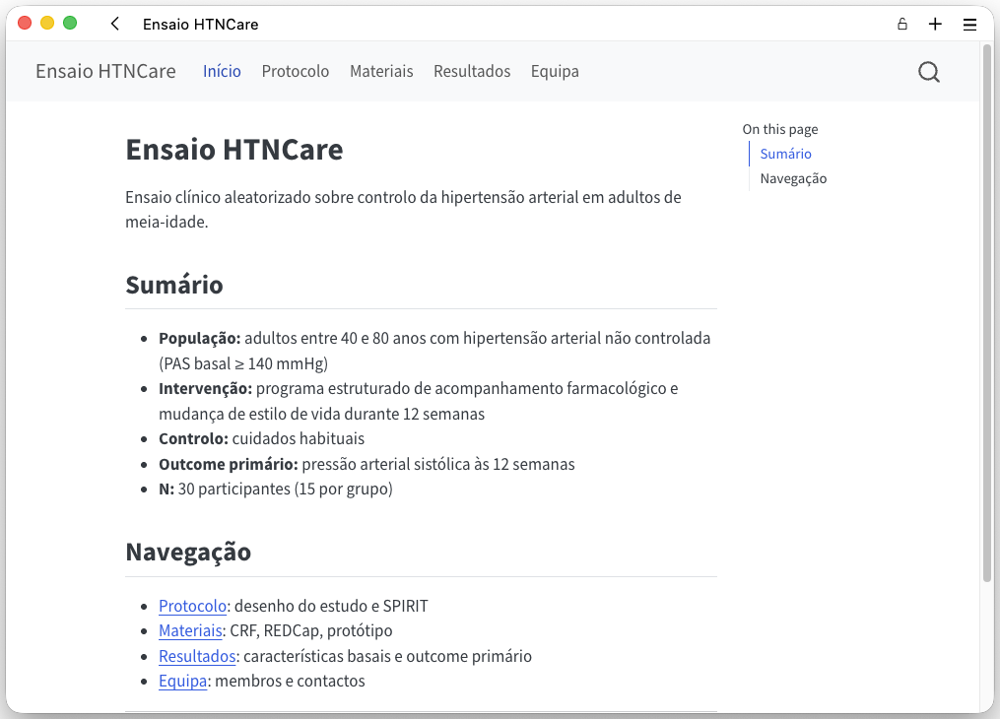
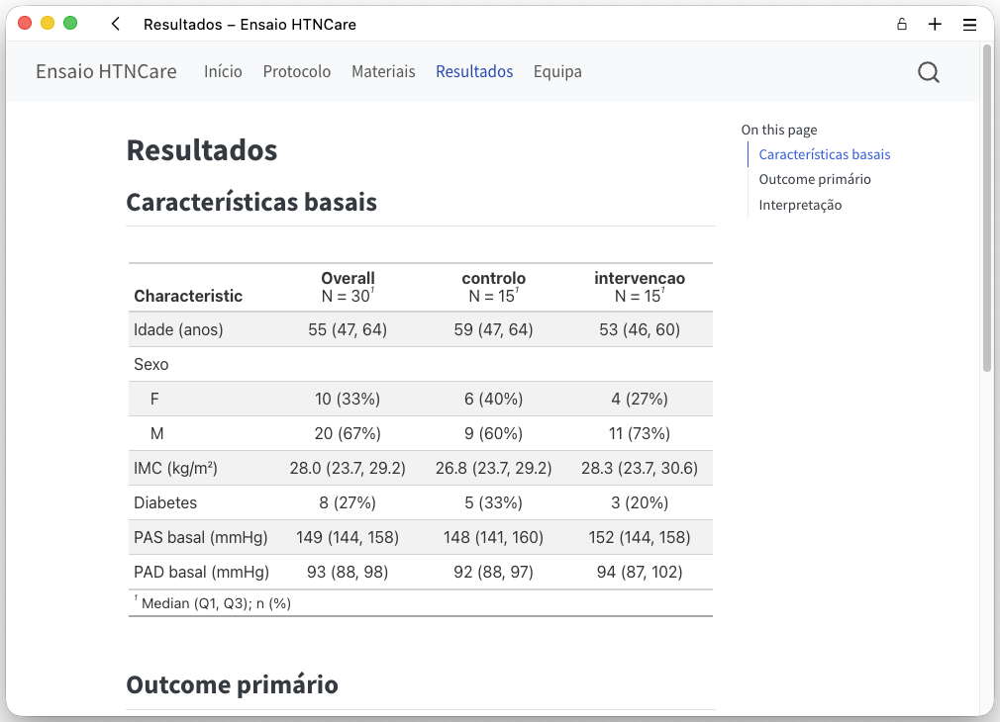
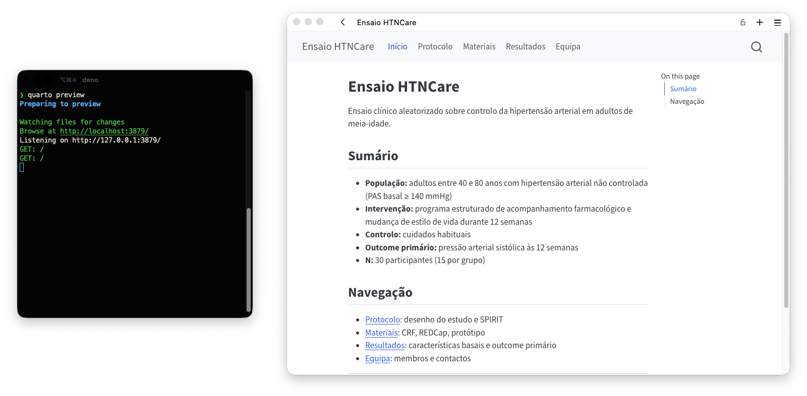
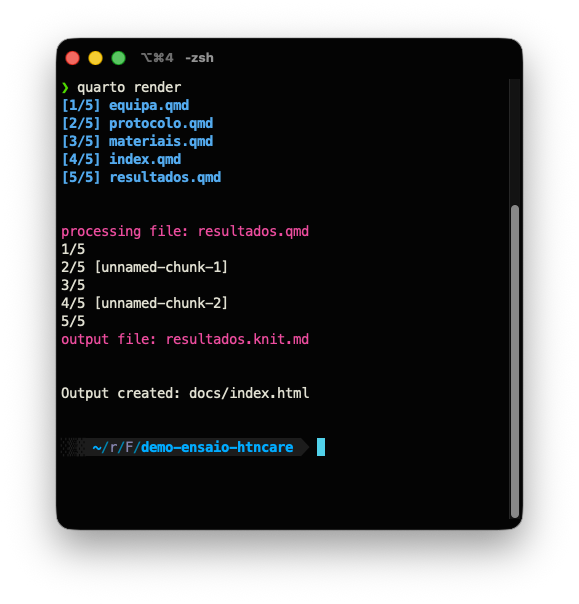
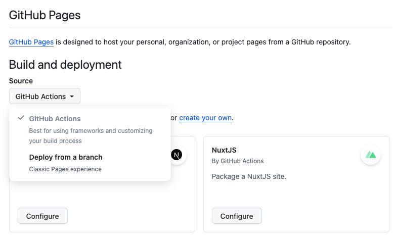

```{r}
#| include: false
library(tidyverse)
library(here)
library(gtsummary)
library(gt)
library(janitor)
dados <- read_csv(here("ficheiros", "htncare.csv"), show_col_types = FALSE)
```

# Abertura {background-color="#2C3E50"}

## Onde estamos no arco do ensaio

| Fase | Estado |
|------|--------|
| TP1 a TP8 | Concluído |
| E2 (materiais) | Entregue |
| TP9 (hoje) | Análise em R + site Quarto |
| TP10 (próxima semana) | Trabalho autónomo |
| TP11 (daqui a 3 semanas) | Apresentação final (o site) |

## Objectivos desta aula

- Analisar os dados do pré-teste em R
- Construir uma Tabela 1 com `gtsummary`
- Construir o gráfico do outcome primário com `ggplot2`
- Montar um site Quarto multi-página
- Publicar no GitHub Pages

## Pré-requisitos

Verificar antes de começar:

- R 4.4 ou superior
- RStudio recente
- Quarto CLI 1.5 ou superior
- Conta GitHub activa

## Instalar os pacotes

```r
install.packages(c(
  "tidyverse",
  "here",
  "gtsummary",
  "gt",
  "janitor"
))
```

Correr uma única vez, no console, nunca dentro de um script.

## Verificar carregamento

```r
library(tidyverse)
library(here)
library(gtsummary)
library(gt)
library(janitor)
```

Sem mensagens de erro: ambiente pronto.

# RStudio produtivo {background-color="#2C3E50"}

## Projectos RStudio

Um projecto é uma pasta com um ficheiro `.Rproj`.

Define a raiz do trabalho e isola o ambiente.

## Porquê usar projectos

- `here::here()` funciona a partir da raiz do projecto
- Sem `setwd()` no código
- Cada projecto tem o seu histórico
- Partilha e reprodução sem adaptações de paths

## Criar um projecto

:::: {.columns}

::: {.column width="45%"}
Ficheiro > New Project > New Directory > New Project

Confirmar "Create a git repository".

Leitura obrigatória pós-aula: [tiagojct.eu/notes/rst-bp](https://tiagojct.eu/notes/rst-bp/)
:::

::: {.column width="55%"}
{fig-alt="Diálogo New Project do RStudio"}
:::

::::

## Estrutura de um projecto

```
ensaio-analise/
├── data/
│   ├── raw/
│   └── processed/
├── scripts/
├── outputs/
│   ├── tabelas/
│   └── figuras/
└── ensaio-analise.Rproj
```

## Responsabilidades por pasta

- `data/raw/`: só de leitura, dados originais
- `data/processed/`: dados limpos, gerados por scripts
- `scripts/`: todo o código
- `outputs/`: tabelas e figuras derivadas

Os outputs são sempre regeneráveis a partir do código.

## Não guardar .RData

Por omissão, o RStudio guarda o workspace ao fechar.

Dizer sempre não.

## Desactivar permanentemente

:::: {.columns}

::: {.column width="45%"}
Tools > Global Options > General > Workspace

- "Restore .RData into workspace at startup": desactivar
- "Save workspace to .RData on exit": Never
:::

::: {.column width="55%"}
{fig-alt="Painel Global Options > General > Workspace do RStudio"}
:::

::::

## Porquê não guardar

O código deve ser a única fonte de verdade.

Um workspace guardado esconde dependências e impede reprodução.

## Atalhos essenciais

| Atalho | Acção |
|--------|-------|
| Ctrl/Cmd + Enter | Executar linha ou selecção |
| Ctrl/Cmd + Shift + M | Inserir pipe (ver nota abaixo) |
| Alt + - | Inserir `<-` |
| Ctrl/Cmd + Shift + F10 | Reiniciar sessão R |

Por omissão, Ctrl/Cmd + Shift + M insere `%>%`. Para o pipe nativo `\|>`, activar Tools > Global Options > Code > "Use native pipe operator".

## Mais atalhos úteis

| Atalho | Acção |
|--------|-------|
| Ctrl/Cmd + Shift + C | Comentar/descomentar |
| Ctrl/Cmd + L | Limpar consola |
| Tab | Auto-completar |

Reiniciar a sessão antes de renderizar é boa prática.

## Estilo de código

```r
# ---- carregar pacotes ----
library(tidyverse)
library(here)

# ---- ler dados ----
dados <- read_csv(here("data", "raw", "htncare.csv"))
```

## Regras de estilo

- Nomes descritivos em `snake_case`
- Sections com `# ----` para navegação no outline
- Uma operação por linha dentro do pipe
- Pipe nativo `|>`, não `%>%`
- `library()` no topo, `install.packages()` nunca no script

## Positron

[Positron](https://positron.posit.co/) é o novo IDE da Posit, baseado em VS Code.

- Mesmo motor Quarto
- Suporte nativo a Python e R em simultâneo
- Interface familiar para quem já usa VS Code

Hoje usamos RStudio. Positron é o caminho a explorar depois.

# Leitura e exploração {background-color="#2C3E50"}

## Carregar pacotes

```r
library(tidyverse)
library(here)
library(janitor)
library(gtsummary)
library(gt)
```

Sempre no topo do script.

## library vs install.packages

`library()` carrega um pacote já instalado.

`install.packages()` instala do CRAN.

Só instalar uma vez, no console. Nunca num script partilhado.

## Paths frágeis

```r
# depende do directório de cada utilizador
read_csv("C:/Users/joao/ensaio/data/htncare.csv")
```

Este código só funciona na máquina do João.

## Paths reprodutíveis com here

```r
read_csv(here("data", "raw", "htncare.csv"))
```

`here::here()` resolve o path a partir da raiz do projecto.

Funciona em qualquer máquina.

## O dataset da aula

HTNCare: ensaio fictício sobre controlo da hipertensão.

- N = 30 (15 intervenção + 15 controlo)
- Outcome primário: pressão sistólica às 12 semanas

## Variáveis do HTNCare

- `patient_id`: identificador
- `grupo`: intervencao / controlo
- `idade`, `sexo`, `imc`, `diabetes`: características basais
- `sbp_baseline`, `sbp_semana12`: pressão sistólica (mmHg)
- `dbp_baseline`, `dbp_semana12`: pressão diastólica (mmHg)
- `adesao`: adesão ao tratamento (0 a 1)

## Ler o dataset

:::: {.columns}

::: {.column width="45%"}
```r
# read_csv: lê um ficheiro CSV
dados <- read_csv(
  here("data", "raw", "htncare.csv")
)
dados
```
:::

::: {.column width="55%"}
```{r}
#| echo: false
dados |>
  select(patient_id, grupo, idade, sexo, sbp_baseline, sbp_semana12) |>
  head(6)
```
:::

::::

Tibble com 30 linhas e 11 colunas (mostradas 6 variáveis acima).

## Explorar a estrutura

:::: {.columns}

::: {.column width="40%"}
```r
# glimpse: estrutura e tipos
glimpse(dados)
```

Mostra o tipo e os primeiros valores de cada variável.
:::

::: {.column width="60%"}
```{r}
#| echo: false
glimpse(dados)
```
:::

::::

## Estatísticas rápidas

:::: {.columns}

::: {.column width="40%"}
```r
# summary: estatísticas rápidas
dados |>
  select(idade, imc,
         sbp_baseline,
         sbp_semana12) |>
  summary()
```

Mínimo, máximo, mediana, média, quartis, NAs.
:::

::: {.column width="60%"}
```{r}
#| echo: false
dados |>
  select(idade, imc, sbp_baseline, sbp_semana12) |>
  summary()
```
:::

::::

## Verificar antes de analisar

- Os tipos de variável estão correctos?
- Há NAs onde não se esperam?
- Os valores estão dentro dos limites plausíveis?

## Nomes problemáticos

:::: {.columns}

::: {.column width="50%"}
```r
# tibble: cria uma tabela
dados_sujos <- tibble(
  "ID Paciente"  = 1:5,
  "Grupo (A/B)"  = c("A","B","A","B","A"),
  "SBP Baseline" = c(155,148,162,151,158)
)
names(dados_sujos)
```

Espaços, parênteses, maiúsculas. Difícil de usar no código.
:::

::: {.column width="50%"}
```{r}
#| echo: false
dados_sujos <- tibble(
  "ID Paciente"  = 1:5,
  "Grupo (A/B)"  = c("A","B","A","B","A"),
  "SBP Baseline" = c(155,148,162,151,158)
)
names(dados_sujos)
```
:::

::::

## Limpar com janitor

:::: {.columns}

::: {.column width="50%"}
```r
# clean_names: snake_case, sem acentos
dados_limpos <- dados_sujos |>
  clean_names()

names(dados_limpos)
```

`clean_names()` converte para `snake_case` e remove caracteres especiais.
:::

::: {.column width="50%"}
```{r}
#| echo: false
dados_sujos |>
  clean_names() |>
  names()
```
:::

::::

## Filtrar linhas

:::: {.columns}

::: {.column width="40%"}
```r
# filter: escolhe linhas por condição
dados |>
  filter(grupo == "intervencao")
```

`filter()` selecciona linhas que cumprem uma condição.
:::

::: {.column width="60%"}
```{r}
#| echo: false
dados |>
  filter(grupo == "intervencao") |>
  select(patient_id, grupo, idade, sbp_baseline) |>
  head(6)
```
:::

::::

## Seleccionar colunas

:::: {.columns}

::: {.column width="45%"}
```r
# select: escolhe colunas pelo nome
dados |>
  select(patient_id,
         sbp_baseline,
         sbp_semana12)
```

`select()` escolhe colunas pelo nome.
:::

::: {.column width="55%"}
```{r}
#| echo: false
dados |>
  select(patient_id, sbp_baseline, sbp_semana12) |>
  head(6)
```
:::

::::

## Criar variáveis

:::: {.columns}

::: {.column width="45%"}
```r
# mutate: cria ou transforma colunas
dados <- dados |>
  mutate(
    reducao_sbp =
      sbp_baseline - sbp_semana12
  )
```

`mutate()` cria ou transforma colunas.
:::

::: {.column width="55%"}
```{r}
#| echo: false
dados |>
  mutate(reducao_sbp = sbp_baseline - sbp_semana12) |>
  select(patient_id, sbp_baseline, sbp_semana12, reducao_sbp) |>
  head(6)
```
:::

::::

## Contar ocorrências

:::: {.columns}

::: {.column width="45%"}
```r
# count: conta combinações
dados |>
  count(grupo, sexo)
```

`count()` conta combinações de valores.
:::

::: {.column width="55%"}
```{r}
#| echo: false
dados |>
  count(grupo, sexo)
```
:::

::::

# Tabela 1 {background-color="#2C3E50"}

## Porquê uma Tabela 1

Num ensaio aleatorizado, a Tabela 1 serve dois propósitos:

- Descrever a amostra
- Verificar o balanceamento dos grupos

## Convenção de apresentação

Estatísticas descritivas por grupo, com coluna "Total".

Variáveis contínuas: mediana (Q1, Q3) ou média (DP).

Variáveis categóricas: n (%).

## tbl_summary em uma linha

:::: {.columns}

::: {.column width="45%"}
```r
# tbl_summary: Tabela 1 por grupo
dados |>
  select(grupo, idade, sexo,
         imc, sbp_baseline) |>
  tbl_summary(by = grupo)
```
:::

::: {.column width="55%"}
```{r}
#| echo: false
dados |>
  select(grupo, idade, sexo, imc, sbp_baseline) |>
  tbl_summary(by = grupo)
```
:::

::::

## O que gtsummary faz

- Detecta o tipo de cada variável
- Escolhe estatísticas adequadas
- Estratifica por `by`
- Formata a tabela automaticamente

## Adicionar total

:::: {.columns}

::: {.column width="45%"}
```r
# add_overall: coluna "Total"
tabela <- dados |>
  select(grupo, idade, sexo,
         imc, sbp_baseline) |>
  tbl_summary(by = grupo) |>
  add_overall()

tabela
```

Coluna "Overall" com o total da amostra.
:::

::: {.column width="55%"}
```{r}
#| echo: false
dados |>
  select(grupo, idade, sexo, imc, sbp_baseline) |>
  tbl_summary(by = grupo) |>
  add_overall()
```
:::

::::

## Adicionar p-values

:::: {.columns}

::: {.column width="45%"}
```r
# add_p: adiciona p-values por variável
dados |>
  select(grupo, idade, sexo,
         imc, sbp_baseline) |>
  tbl_summary(by = grupo) |>
  add_overall() |>
  add_p()
```
:::

::: {.column width="55%"}
```{r}
#| echo: false
#| warning: false
dados |>
  select(grupo, idade, sexo, imc, sbp_baseline) |>
  tbl_summary(by = grupo) |>
  add_overall() |>
  add_p()
```
:::

::::

## Nota sobre p-values no baseline

Num RCT bem aleatorizado, diferenças de baseline são fruto do acaso.

`add_p()` é útil como verificação, mas controverso como prova de balanceamento. Usar com critério.

## Formatar labels

:::: {.columns}

::: {.column width="45%"}
```r
# label: renomeia cada variável
dados |>
  select(grupo, idade, sexo,
         imc, sbp_baseline) |>
  tbl_summary(
    by = grupo,
    label = list(
      idade        ~ "Idade (anos)",
      sexo         ~ "Sexo",
      imc          ~ "IMC (kg/m²)",
      sbp_baseline ~ "PAS basal (mmHg)"
    )
  )
```
:::

::: {.column width="55%"}
```{r}
#| echo: false
dados |>
  select(grupo, idade, sexo, imc, sbp_baseline) |>
  tbl_summary(
    by = grupo,
    label = list(
      idade        ~ "Idade (anos)",
      sexo         ~ "Sexo",
      imc          ~ "IMC (kg/m²)",
      sbp_baseline ~ "PAS basal (mmHg)"
    )
  )
```
:::

::::

## Controlar estatísticas

:::: {.columns}

::: {.column width="45%"}
```r
# statistic: define sumário
# digits: casas decimais
dados |>
  select(grupo, idade, sexo,
         imc, sbp_baseline) |>
  tbl_summary(
    by = grupo,
    statistic = list(
      all_continuous()  ~ "{mean} ({sd})",
      all_categorical() ~ "{n} ({p}%)"
    ),
    digits = all_continuous() ~ 1
  )
```
:::

::: {.column width="55%"}
```{r}
#| echo: false
dados |>
  select(grupo, idade, sexo, imc, sbp_baseline) |>
  tbl_summary(
    by = grupo,
    statistic = list(
      all_continuous()  ~ "{mean} ({sd})",
      all_categorical() ~ "{n} ({p}%)"
    ),
    digits = all_continuous() ~ 1
  )
```
:::

::::

## Exportar para HTML

```r
tabela |>
  as_gt() |>
  gt::gtsave("outputs/tabelas/tabela_basal.html")
```

Para integrar no Quarto, basta incluir `tabela` num bloco R. Não é preciso exportar.

# Gráfico do outcome primário {background-color="#2C3E50"}

## Grammar of graphics

Um gráfico é construído por camadas.

- **data**: o tibble
- **aes()**: mapeamento de variáveis para propriedades visuais
- **geom_**: a geometria
- **theme_**: o tema visual

## Boxplot mínimo

:::: {.columns}

::: {.column width="50%"}
```r
# geom_boxplot: caixa de bigodes
ggplot(dados,
       aes(x = grupo,
           y = sbp_semana12)) +
  geom_boxplot()
```

Cada `+` acrescenta uma camada.
:::

::: {.column width="50%"}
```{r}
#| echo: false
#| fig-width: 4
#| fig-height: 3.2
ggplot(dados, aes(x = grupo, y = sbp_semana12)) +
  geom_boxplot() +
  theme_minimal(base_size = 12)
```
:::

::::

## Adicionar pontos

:::: {.columns}

::: {.column width="50%"}
```r
# geom_jitter: pontos com jitter horizontal
ggplot(dados,
       aes(x = grupo,
           y = sbp_semana12)) +
  geom_boxplot(
    outlier.shape = NA,
    width = 0.4
  ) +
  geom_jitter(
    width = 0.12,
    alpha = 0.7,
    size = 2.5
  )
```

`outlier.shape = NA` evita duplicação de pontos.
:::

::: {.column width="50%"}
```{r}
#| echo: false
#| fig-width: 4
#| fig-height: 3.2
ggplot(dados, aes(x = grupo, y = sbp_semana12)) +
  geom_boxplot(outlier.shape = NA, width = 0.4) +
  geom_jitter(width = 0.12, alpha = 0.7, size = 2.5) +
  theme_minimal(base_size = 12)
```
:::

::::

## Adicionar cor

:::: {.columns}

::: {.column width="50%"}
```r
# aes(colour = grupo): mapeia cor
ggplot(dados,
       aes(x = grupo,
           y = sbp_semana12,
           colour = grupo)) +
  geom_boxplot(
    outlier.shape = NA,
    width = 0.4
  ) +
  geom_jitter(
    width = 0.12,
    alpha = 0.7,
    size = 2.5
  )
```
:::

::: {.column width="50%"}
```{r}
#| echo: false
#| fig-width: 4
#| fig-height: 3.2
ggplot(dados, aes(x = grupo, y = sbp_semana12, colour = grupo)) +
  geom_boxplot(outlier.shape = NA, width = 0.4) +
  geom_jitter(width = 0.12, alpha = 0.7, size = 2.5) +
  theme_minimal(base_size = 12)
```
:::

::::

## Cores da identidade visual

:::: {.columns}

::: {.column width="50%"}
```r
# scale_colour_manual: paleta fixa
ggplot(dados,
       aes(x = grupo,
           y = sbp_semana12,
           colour = grupo)) +
  geom_boxplot(outlier.shape = NA,
               width = 0.4) +
  geom_jitter(width = 0.12,
              alpha = 0.7,
              size = 2.5) +
  scale_colour_manual(
    values = c(
      "intervencao" = "#2C3E50",
      "controlo"    = "#7A9B9E"
    )
  )
```

Manter paleta consistente em todo o projecto.
:::

::: {.column width="50%"}
```{r}
#| echo: false
#| fig-width: 4
#| fig-height: 3.2
ggplot(dados, aes(x = grupo, y = sbp_semana12, colour = grupo)) +
  geom_boxplot(outlier.shape = NA, width = 0.4) +
  geom_jitter(width = 0.12, alpha = 0.7, size = 2.5) +
  scale_colour_manual(
    values = c("intervencao" = "#2C3E50", "controlo" = "#7A9B9E")
  ) +
  theme_minimal(base_size = 12)
```
:::

::::

## Labels e tema

:::: {.columns}

::: {.column width="50%"}
```r
# labs: títulos e eixos
# theme_minimal: tema limpo
ggplot(dados,
       aes(x = grupo,
           y = sbp_semana12,
           colour = grupo)) +
  geom_boxplot(outlier.shape = NA,
               width = 0.4) +
  geom_jitter(width = 0.12,
              alpha = 0.7,
              size = 2.5) +
  scale_colour_manual(
    values = c(
      "intervencao" = "#2C3E50",
      "controlo"    = "#7A9B9E"
    )
  ) +
  labs(
    x     = "Grupo",
    y     = "PAS às 12 semanas (mmHg)",
    title = "HTNCare: outcome primário"
  ) +
  theme_minimal(base_size = 13) +
  theme(legend.position = "none")
```
:::

::: {.column width="50%"}
```{r}
#| echo: false
#| fig-width: 4
#| fig-height: 3.5
ggplot(dados, aes(x = grupo, y = sbp_semana12, colour = grupo)) +
  geom_boxplot(outlier.shape = NA, width = 0.4) +
  geom_jitter(width = 0.12, alpha = 0.7, size = 2.5) +
  scale_colour_manual(
    values = c("intervencao" = "#2C3E50", "controlo" = "#7A9B9E")
  ) +
  labs(
    x     = "Grupo",
    y     = "PAS às 12 semanas (mmHg)",
    title = "HTNCare: outcome primário"
  ) +
  theme_minimal(base_size = 11) +
  theme(legend.position = "none")
```
:::

::::

## Guardar a figura

```r
ggsave(
  here("outputs", "figuras", "figura_outcome.png"),
  width  = 6,
  height = 4,
  dpi    = 150
)
```

`ggsave()` grava o último gráfico gerado. No guião, o código final atribui a figura a `fig_outcome` e passa `plot = fig_outcome` explicitamente.

# Site Quarto {background-color="#2C3E50"}

## O que é Quarto

Sistema de publicação científica.

Converte ficheiros `.qmd` em HTML, PDF, revealjs, e outros formatos.

## Porquê um website

Agrega múltiplas páginas com:

- Navegação consistente
- Tema partilhado
- Uma única configuração

## Criar o projecto

No Terminal do RStudio:

```bash
quarto create project website ensaio-site
```

## Estrutura gerada

```
ensaio-site/
├── _quarto.yml
├── index.qmd
├── about.qmd
└── styles.css
```

## Configuração mínima

:::: {.columns}

::: {.column width="50%"}
```yaml
# _quarto.yml: configuração do site
project:
  type: website
  output-dir: docs                     # <1>

website:
  title: "Ensaio HTNCare"
```

1. Directoria de saída do render. Necessária para GitHub Pages com "Deploy from branch".
:::

::: {.column width="50%"}
{fig-alt="Página inicial do site HTNCare renderizado"}
:::

::::

## Navbar

:::: {.columns}

::: {.column width="50%"}
```yaml
# navbar: barra de navegação
website:
  navbar:
    left:
      - href: index.qmd
        text: Início
      - href: protocolo.qmd
        text: Protocolo
      - href: materiais.qmd
        text: Materiais
      - href: resultados.qmd
        text: Resultados
      - href: equipa.qmd
        text: Equipa
```
:::

::: {.column width="50%"}
{fig-alt="Barra de navegação do site renderizada no browser"}
:::

::::

## Páginas a criar

- `index.qmd`: home
- `protocolo.qmd`: SPIRIT da E1
- `materiais.qmd`: CRF, REDCap, E2
- `resultados.qmd`: análise dos dados
- `equipa.qmd`: membros e contactos

## Página mínima

```yaml
---
title: "Protocolo"
format: html
---
```

Uma página é um `.qmd` com YAML e conteúdo Markdown.

## Integrar uma tabela

:::: {.columns}

::: {.column width="50%"}
````markdown
```{{r}}
#| echo: false
#| message: false
# bloco silencioso: só carrega
library(tidyverse)
library(gtsummary)
library(here)

dados <- read_csv(
  here("data", "raw", "htncare.csv")
)
```
````

`echo: false` esconde o código. `message: false` suprime mensagens de carregamento.
:::

::: {.column width="50%"}
{fig-alt="Página 'Resultados' do site renderizada com tabela e gráfico"}
:::

::::

## Chamar gtsummary

:::: {.columns}

::: {.column width="45%"}
````markdown
```{{r}}
#| echo: false

# tbl_summary: Tabela 1
dados |>
  select(grupo, idade, sexo,
         sbp_baseline) |>
  tbl_summary(by = grupo) |>
  add_overall()
```
````

A tabela é renderizada no HTML directamente.
:::

::: {.column width="55%"}
```{r}
#| echo: false
dados |>
  select(grupo, idade, sexo, sbp_baseline) |>
  tbl_summary(by = grupo) |>
  add_overall()
```
:::

::::

## Incluir um gráfico

:::: {.columns}

::: {.column width="50%"}
````markdown
```{{r}}
#| echo: false
#| fig-width: 6
#| fig-height: 4

# ggplot: gráfico do outcome
ggplot(
  dados |> filter(!is.na(sbp_semana12)),
  aes(x = grupo, y = sbp_semana12)
) +
  geom_boxplot(outlier.shape = NA) +
  geom_jitter(width = 0.12,
              alpha = 0.7) +
  theme_minimal()
```
````
:::

::: {.column width="50%"}
```{r}
#| echo: false
#| fig-width: 4
#| fig-height: 3.2
ggplot(dados |> filter(!is.na(sbp_semana12)),
       aes(x = grupo, y = sbp_semana12)) +
  geom_boxplot(outlier.shape = NA) +
  geom_jitter(width = 0.12, alpha = 0.7) +
  theme_minimal(base_size = 11)
```
:::

::::

## Preview em tempo real

:::: {.columns}

::: {.column width="45%"}
```bash
# quarto preview: recarrega ao gravar
quarto preview
```

Abre o browser e actualiza a cada save.
:::

::: {.column width="55%"}
{fig-alt="Terminal com 'quarto preview' e browser com site em directo"}
:::

::::

## Build completo

:::: {.columns}

::: {.column width="45%"}
```bash
# quarto render: build estático
quarto render
```

Processa todos os `.qmd` e escreve em `docs/`.
:::

::: {.column width="55%"}
{fig-alt="Terminal após 'quarto render' com lista dos ficheiros processados"}
:::

::::

# Publicação {background-color="#2C3E50"}

## Passos de publicação

:::: {.columns}

::: {.column width="45%"}
1. Commit e push para `main`
2. Aguardar o workflow correr uma vez (cria a branch `gh-pages`)
3. Settings > Pages > Source: "Deploy from a branch"
4. Branch: `gh-pages` · Folder: `/ (root)` · Save
:::

::: {.column width="55%"}
{fig-alt="Página Settings > Pages com Source 'Deploy from a branch' apontado a gh-pages/root"}
:::

::::

## URL do site

`https://utilizador.github.io/nome-do-repo`

O workflow corre em cada push para `main`.

## Estrutura do workflow

```yaml
on:
  push:
    branches: main                                    # <1>

jobs:
  build-deploy:
    runs-on: ubuntu-latest                            # <2>
    steps:
      - uses: actions/checkout@v4                     # <3>
      - uses: r-lib/actions/setup-r@v2                # <4>
      - uses: r-lib/actions/setup-r-dependencies@v2   # <5>
        with:
          packages: |
            tidyverse
            gtsummary
      - uses: quarto-dev/quarto-actions/setup@v2      # <6>
      - run: quarto render                            # <7>
      - uses: quarto-dev/quarto-actions/publish@v2    # <8>
        with:
          target: gh-pages
```

1. Dispara a cada push para `main`.
2. Máquina virtual Ubuntu fornecida pelo GitHub.
3. Clona o repositório.
4. Instala R.
5. Instala pacotes R necessários.
6. Instala Quarto.
7. Renderiza o site.
8. Publica o output na branch `gh-pages`.

## Alternativa: Posit Connect Cloud

[Posit Connect Cloud](https://connect.posit.cloud/) publica aplicações Shiny, documentos Quarto, e APIs.

- Deploy via drag-and-drop ou GitHub
- Plano gratuito disponível
- Útil para sites dinâmicos

Para este projecto, GitHub Pages é mais simples.

# Encerramento {background-color="#2C3E50"}

## Referência obrigatória

[RStudio: Best Practices for Scientific Work](https://tiagojct.eu/notes/rst-bp/)

Cobre projectos, estrutura de pastas, `here::here()`, estilo de código, reprodutibilidade.

## Documentação Quarto

[quarto.org](https://quarto.org/) tem tudo o que precisam:

- Tutoriais passo a passo
- Referência completa (YAML, opções de chunks, formatos de output)
- Exemplos de sites, livros, revealjs, PDF
- [Discussões no GitHub](https://github.com/quarto-dev/quarto-cli/discussions): suporte activo da comunidade e da Posit

Consultar sempre primeiro antes de perguntar.

## Próximos passos

- **Esta semana**: rever o guião e começar o exercício
- **Próxima semana (TP10)**: trabalho autónomo, entregar formativa no Moodle até ao fim da semana (estrutura do site + TP8)
- **Semana seguinte**: feedback à entrega formativa
- **Semana a seguir (TP11)**: apresentação final (site completo com declaração de IA) no dia da aula

## Contacto

Tiago Jacinto

- [tiagojacinto@med.up.pt](mailto:tiagojacinto@med.up.pt)
- [tiagojct.eu](https://tiagojct.eu)
- ORCID [0000-0002-7897-1101](https://orcid.org/0000-0002-7897-1101)

Dúvidas durante a TP10: Moodle ou email.
